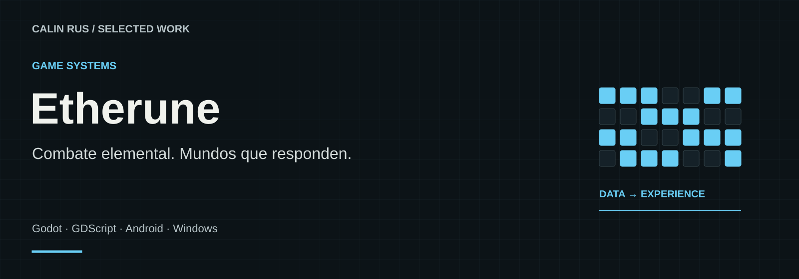
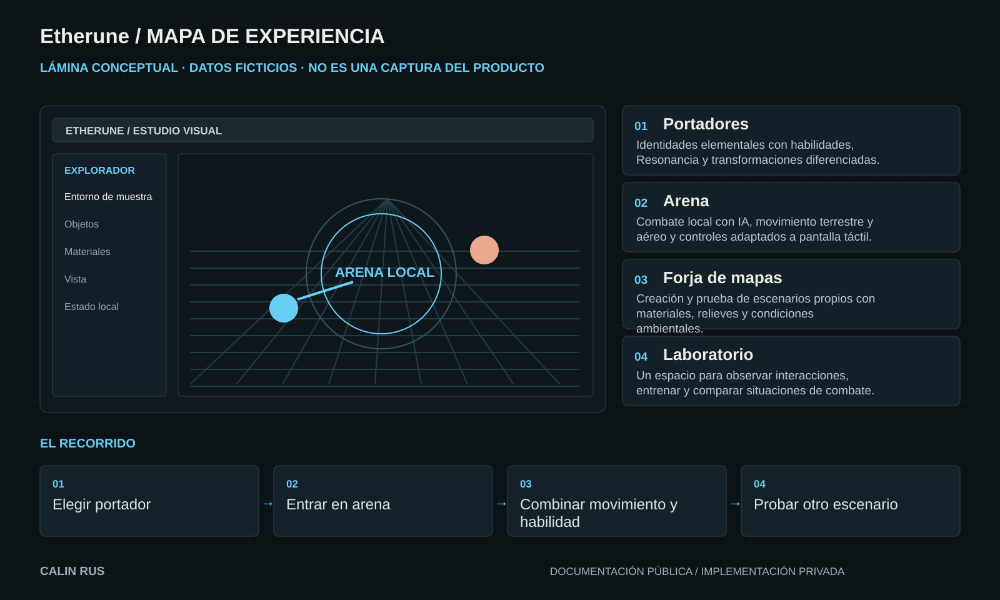
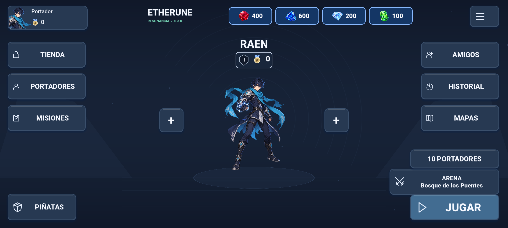
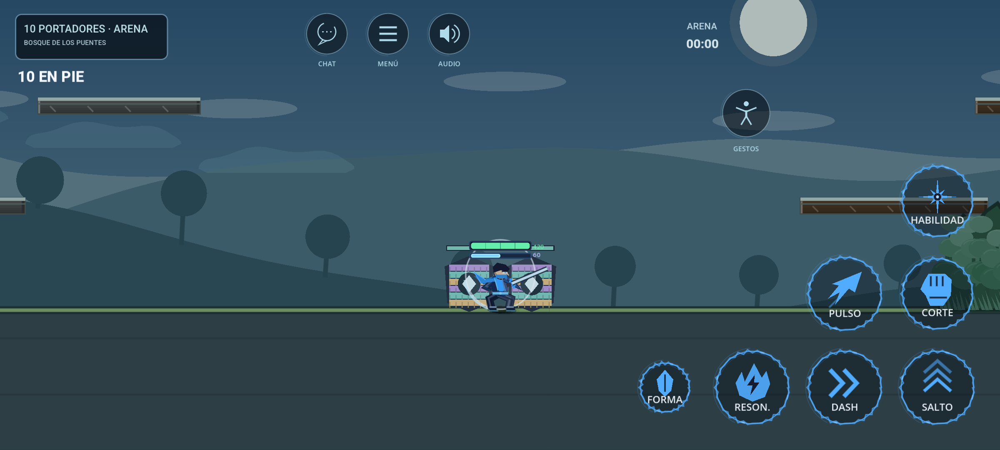
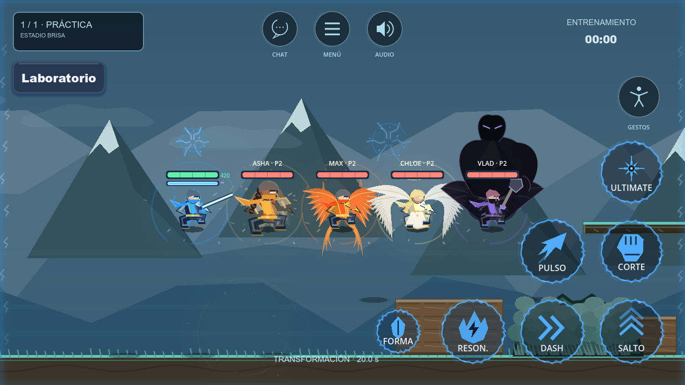

# Etherune

**Combate elemental. Mundos que responden.**

Mi videojuego de combate elemental 2D: portadores, transformaciones, movimiento aéreo y escenarios que se pueden crear y explorar. Desarrollado en Godot, con colaboración de una diseñadora 2D en su evolución visual.

**Stack:** Godot · GDScript · Android · Windows  
**Estado:** Videojuego en desarrollo · Colaboración de diseño 2D

[Portfolio](https://github.com/calinrus-dev/portfolio) · [Experiencia](docs/EXPERIENCIA.md) · [Componentes](docs/COMPONENTES.md) · [Diseño técnico](docs/ARQUITECTURA.md) · [Demostraciones](docs/DEMOSTRACIONES.md) · [Estado](docs/ESTADO.md)

## El problema que aborda

Construir un combate con identidad exige que personaje, controles, efectos y entorno respondan al mismo lenguaje. Etherune explora esa relación en una experiencia local y editable.

## Qué compone la experiencia

- **Portadores.** Identidades elementales con habilidades, Resonancia y transformaciones diferenciadas.
- **Arena.** Combate local con IA, movimiento terrestre y aéreo y controles adaptados a pantalla táctil.
- **Forja de mapas.** Edición de escenarios con materiales, relieves y condiciones ambientales.
- **Laboratorio.** Un espacio para observar interacciones, entrenar y comparar situaciones de combate.

*Lámina explicativa con datos ficticios. Su contenido también está disponible como texto en [Componentes](docs/COMPONENTES.md).*

## Galería real

*Lobby de la versión Android 0.3.0. Perfil de prueba.*

*Arena local con controles táctiles. Captura de prueba; no demuestra conexión online.*

*Comparación visual de portadores en el laboratorio local.*

## Decisiones que definen el proyecto

- **Identidad antes que volumen.** Cada portador debe reconocerse por su movimiento, sus efectos y sus posibilidades de juego.
- **Crear y jugar cerca.** El editor y el laboratorio acortan el recorrido entre construir una arena y comprobar cómo se juega.
- **Experiencia local explícita.** Las escenas de combate no se presentan como multijugador online.

## Explorar el caso

- [Experiencia y recorrido](docs/EXPERIENCIA.md): intención, interacción y criterios de revisión.
- [Componentes](docs/COMPONENTES.md): las piezas visibles y el papel de cada una.
- [Diseño técnico](docs/ARQUITECTURA.md): responsabilidades y compromisos de diseño.
- [Demostraciones](docs/DEMOSTRACIONES.md): qué enseñan las imágenes y cómo leer la evidencia.
- [Estado y siguientes pasos](docs/ESTADO.md): alcance actual, comprobaciones y trabajo pendiente.

## Sobre este repositorio

Caso de estudio público de un proyecto con implementación privada. Reúne documentación, diagramas e imágenes seleccionadas. Los detalles del motor, integraciones, datos operativos y código se mantienen en los repositorios privados.

Revisión editorial: 28 de septiembre de 2026. Autor: [Calin Rus](https://github.com/calinrus-dev).

[calinrus.com](https://calinrus.com) · [Instagram @c4linrus](https://www.instagram.com/c4linrus/) · [Todos los proyectos](https://github.com/calinrus-dev/portfolio)
