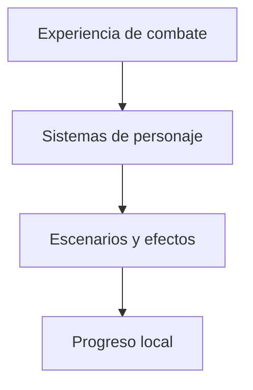

# Etherune / Diseño técnico

[← Inicio](../README.md)

## Contexto

Un juego de combate 2D que reúne portadores elementales, movimiento aéreo, transformaciones y creación de escenarios en una misma experiencia.

**Tecnologías asociadas al proyecto:** Godot · GDScript · Android · Windows.

## Mapa de responsabilidades

Este mapa conceptual organiza la explicación del producto; no representa endpoints, procesos desplegados ni contratos internos.

## Identidad antes que volumen

Cada portador debe reconocerse por su movimiento, sus efectos y sus posibilidades de juego.

## Crear y jugar cerca

El editor y el laboratorio acortan el recorrido entre construir una arena y comprobar cómo se juega.

## Experiencia local explícita

Las escenas de combate no se presentan como multijugador online.

## Rendimiento y dependencia

Mi criterio de trabajo es medir antes de optimizar: identificar el recorrido relevante, observar tiempo de respuesta y uso de recursos y comparar cambios con la misma carga. En sistemas nativos también me interesa la disposición de datos, la localidad de memoria y el trabajo repetido.

Local-first es una preferencia arquitectónica: conservar una experiencia útil y control sobre los datos en el dispositivo, e incorporar servicios externos cuando aporten una función concreta. Su alcance varía por proyecto; no implica que todas las integraciones de este caso funcionen sin conexión.

No se publican cifras de rendimiento sin un ensayo identificado. La evidencia específica disponible está en [Estado](ESTADO.md).

## Qué conviene demostrar después

- Pulir legibilidad del combate y feedback táctil.
- Ampliar pruebas en dispositivos y sesiones prolongadas.
- Consolidar el recorrido entre selección, arena y editor.
