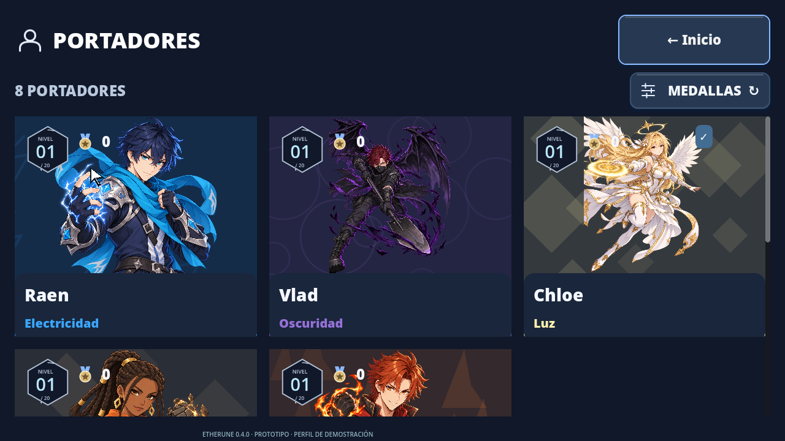
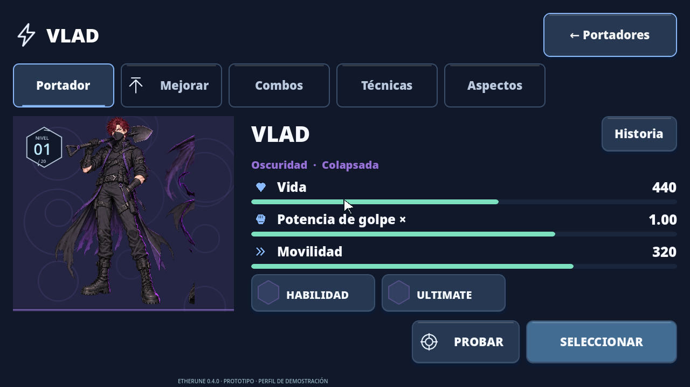
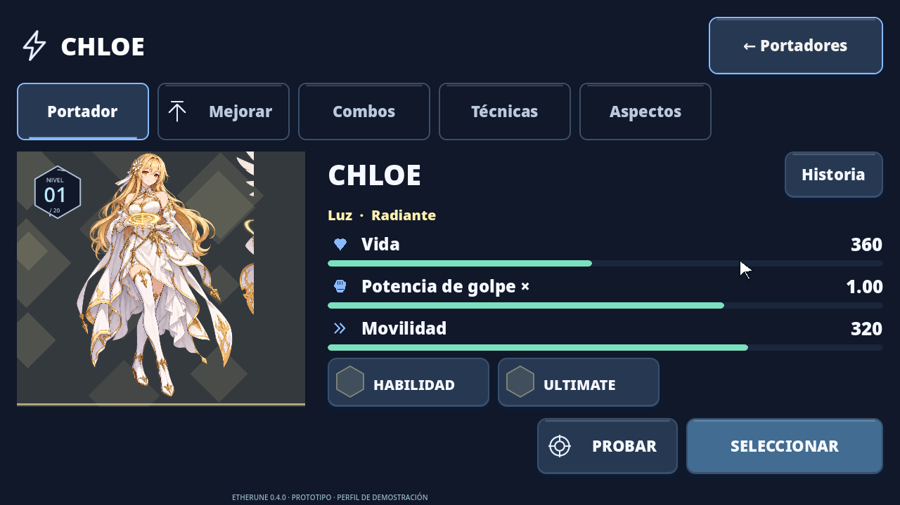
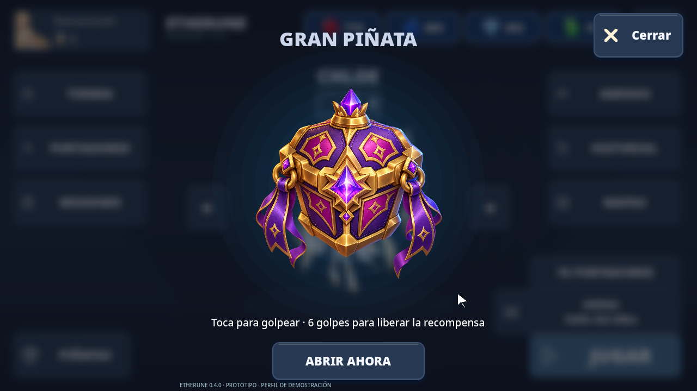
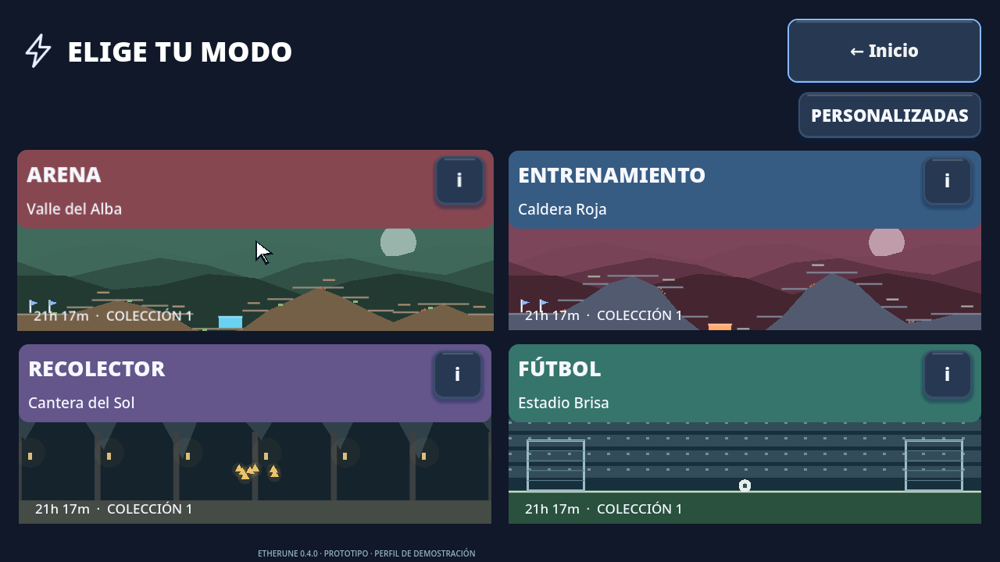
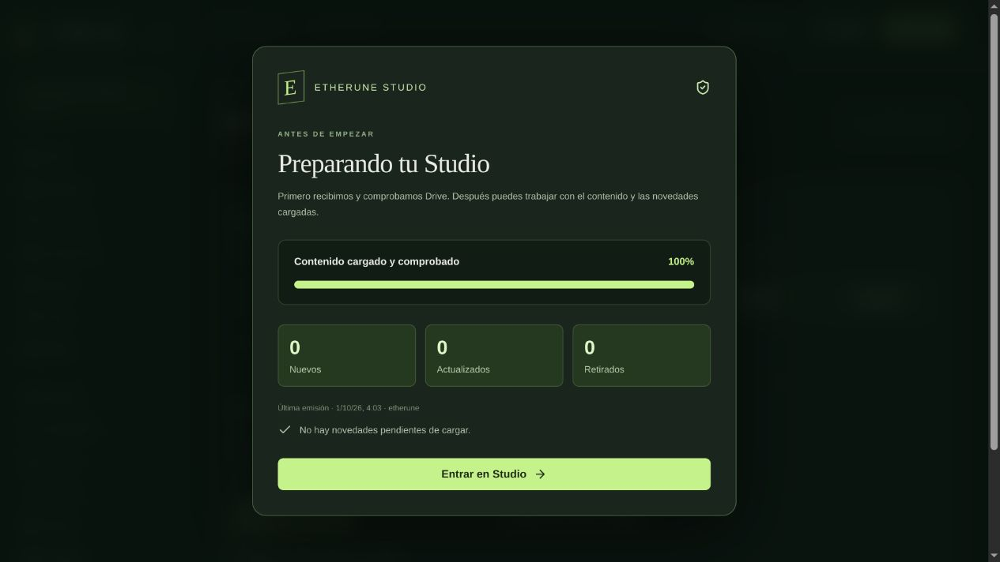
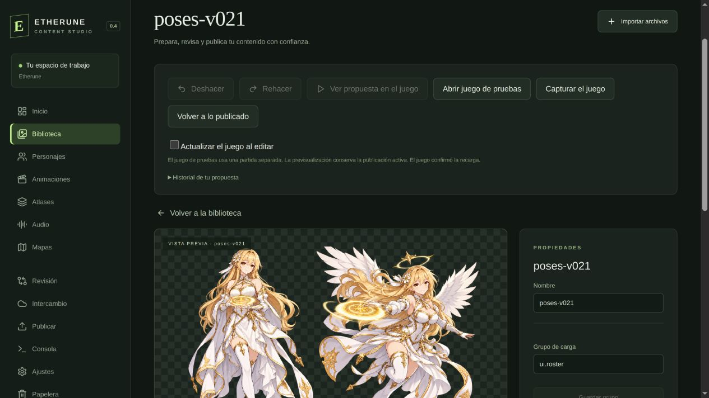
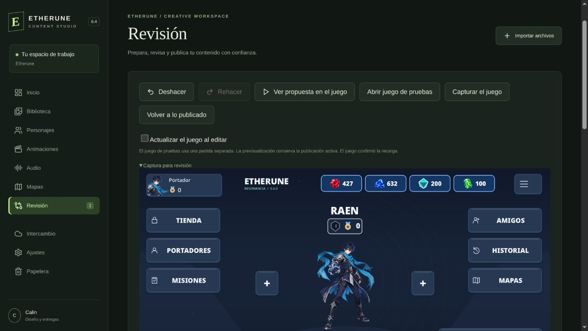
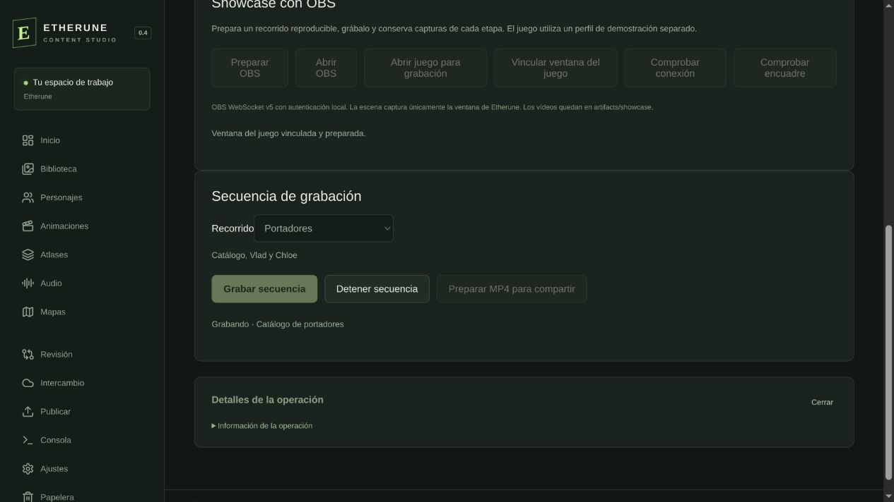

# Etherune 0.4.0 · Del recurso al juego

[← Proyecto](../README.md) · [Showcase con vídeo](https://calinrus-dev.github.io/etherune-showcase/)

Revisión del 1 de octubre de 2026. El juego sigue siendo un prototipo en desarrollo. Joana Mauriño Casado se suma al diseño 2D del proyecto; esta colaboración no atribuye automáticamente el arte anterior a su autoría.

## El recorrido grabado

[Ver o descargar el vídeo real, 66 segundos](../assets/videos/etherune-0.4.0.mp4). OBS captura la ventana del juego en una partida de demostración aislada. El recorrido abre el catálogo de portadores, Vlad y Chloe, golpea la gran piñata, muestra sus tres recompensas y recorre los modos antes de regresar al menú. El sonido procede del propio juego. No se presenta como una partida de combate ni como una prueba de multijugador.

[Vídeo conjunto del juego y Studio, 82 segundos](../assets/videos/etherune-0.4.0-studio.mp4). Añade al recorrido cuatro capturas reales de las etapas de trabajo, con rótulos explicativos.

## El flujo de Studio

1. **Recibir y comprobar.** La ventana inicial muestra progreso y novedades. La edición se habilita cuando termina la recepción desde Drive.
2. **Crear y revisar.** La biblioteca conserva identidades estables, grupos, etiquetas, metadatos y versiones. El perfil identifica a quien edita. La papelera y el historial permiten recuperar cambios.
3. **Probar en el juego.** Una propuesta puede verse directamente en el proyecto, compararse y deshacerse antes de publicar. Los recursos vectoriales y los sprites conviven durante la migración.
4. **Entregar, validar y publicar.** La vista de diseño simplifica las herramientas; desarrollo conserva validación y publicación. Al finalizar, la sesión sincroniza sus cambios. Los equipos trabajan con la publicación recibida y la sesión controla conflictos.

La captura de previsualización muestra una propuesta de prueba que se archivó después, no un cambio aplicado a la publicación actual. La captura de OBS documenta el progreso de una grabación y su control de parada; también se verificó que detener conserva el vídeo parcial.

## Organización y colaboración

Drive recibe publicaciones, fuentes, propuestas e historial en carpetas separadas. El código del juego, configuraciones locales y credenciales permanecen en el repositorio privado. Este showcase contiene únicamente documentación, muestras públicas, vídeos y capturas seleccionadas.

Buscamos colaboración en diseño 2D, desarrollo Godot y, sobre todo, sonido: efectos, ambientes y mezcla. [Contactar con Calin](https://www.linkedin.com/in/calinrus-dev/).

## Comprobaciones

En el proyecto privado se ejecutaron 69 pruebas Rust, 5 pruebas de los flujos TypeScript y 847 comprobaciones Godot. Se compiló Studio nativo en Linux y se comprobó una grabación real con OBS WebSocket, incluida la cancelación desde la interfaz. CI completada correctamente el 1 de octubre de 2026: pruebas y compilación nativa de Studio en Ubuntu 24.04 y Windows. La prueba gráfica de Studio y OBS en un equipo físico Windows sigue pendiente. Estas cifras son evidencia declarada del proyecto privado y se distinguen de las pruebas ejecutables de este repositorio público.
